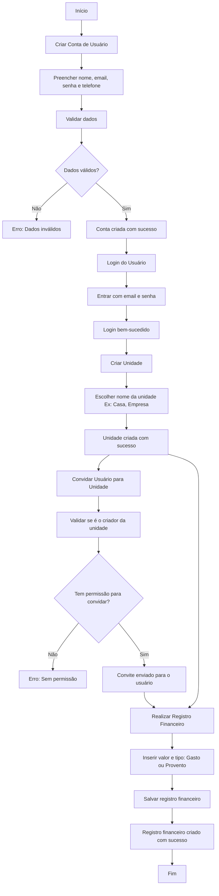

# WltControl

Este é o projeto WltControl, estruturado com DDD (Domain-Driven Design).

## Estrutura do Projeto
- **API**: Contém os controladores e view models.
- **Application**: Contém os serviços, DTOs, interfaces e validadores.
- **Domain**: Contém as entidades, value objects, repositórios e exceções.
- **Infrastructure**: Contém as implementações de infraestrutura, como logs e contexto de banco de dados.

## Como Usar
1. Clone o repositório.
2. Restaure as dependências: dotnet restore.
3. Execute a solução: dotnet run.

# Documentação do WltControl API com DDD e .NET 8

## Descrição Geral
Este projeto visa criar uma API utilizando .NET 8, seguindo os princípios do Domain-Driven Design (DDD). A API será usada para gerenciar usuários, suas unidades, e registros financeiros (gastos e proventos). Abaixo estão os requisitos e funcionalidades detalhados, organizados de forma que facilitem a criação de diagramas de fluxo e o desenvolvimento.

---

## Entidades Principais

### Usuário
**Dados:**
- Nome
- Email (único)
- Data de nascimento
- Senha (armazenada de forma segura, como hash)
- Telefone
- **Ativo** (bool): Indica se o usuário está ativo ou desativado (não será excluído).

**Funcionalidades:**
1. **Criar Usuário:**
   - Endpoint para criação de um novo usuário com validação de senha (senha e confirmação).
2. **Visualizar Dados do Usuário:**
   - Recupera informações como Nome, Email, Data de nascimento e Telefone.
3. **Atualizar Perfil:**
   - Permite atualizar Nome, Email, Data de nascimento e Telefone.
4. **Alterar Senha:**
   - Requer a senha antiga e a nova senha (com confirmação).
5. **Desativar Usuário:**
   - Apenas o usuário autenticado pode desativar sua conta (não exclui, apenas desativa o acesso).

---

### Unidade
**Descrição:**
- Representa uma unidade organizacional ou categoria vinculada ao usuário. Pode ser, por exemplo, a "minha casa" ou "minha empresa".
- A unidade pode ter vários usuários associados, e cada usuário tem um papel na unidade (ex: Administrador ou Colaborador).

**Dados:**
- Nome da unidade
- Usuário responsável (IdUsuario)
- **Ativo** (bool): Indica se a unidade está ativa ou desativada.
- Enum de Papéis:
  - **Administrador**: Criador da unidade.
  - **Colaborador**: Usuário comum com permissões limitadas.

**Funcionalidades:**
1. **CRUD de Unidade:**
   - Criar, atualizar, listar e excluir unidades.
2. **Listar Unidades de um Usuário:**
   - Filtrar unidades pertencentes a um usuário específico.
3. **Desativar Unidade:**
   - Apenas o criador da unidade pode desativá-la (não exclui, apenas desativa o acesso).
4. **Remover Usuário da Unidade:**
   - Apenas o criador da unidade pode remover usuários associados à unidade.
5. **Atribuir Papéis:**
   - Permite atribuir papéis de "Administrador" e "Colaborador" a outros usuários dentro da unidade.

---

### Registro Financeiro
**Descrição:**
- Representa um gasto ou um provento associado a um usuário e a uma unidade.

**Dados:**
- IdUsuario
- Valor (positivo ou negativo dependendo do tipo)
- Tipo (Gasto ou Provento)
- IdUnidade
- Data do gasto
- Data de registro
- Data de atualização

**Funcionalidades:**
1. **CRUD de Registro Financeiro:**
   - Criar, atualizar, listar e excluir registros.
2. **Listar Registros de um Usuário:**
   - Permite filtrar registros por IdUsuario, IdUnidade, Tipo ou intervalo de datas.
3. **Agrupar Registros por Unidade:**
   - Facilita análise financeira agrupando gastos e proventos por unidade.
4. **Relatório Resumido:**
   - Retorna um resumo financeiro com total de gastos, proventos e saldo para um usuário.

---

## Estrutura de Rotas

### Usuários
- `POST /usuarios` - Criar novo usuário
- `GET /usuarios/{id}` - Visualizar dados do usuário
- `PUT /usuarios/{id}` - Atualizar perfil do usuário
- `PATCH /usuarios/{id}/alterar-senha` - Alterar senha do usuário
- `PATCH /usuarios/{id}/desativar` - Desativar usuário (apenas o próprio usuário pode desativar)

### Unidades
- `POST /unidades` - Criar nova unidade
- `GET /unidades` - Listar unidades do usuário autenticado
- `PUT /unidades/{id}` - Atualizar unidade existente
- `DELETE /unidades/{id}` - Excluir unidade
- `PATCH /unidades/{id}/desativar` - Desativar unidade (apenas o criador da unidade pode desativar)
- `PATCH /unidades/{id}/remover-usuario` - Remover um usuário da unidade (apenas o criador da unidade pode remover)

### Registros Financeiros
- `POST /registros` - Criar novo registro financeiro
- `GET /registros` - Listar registros do usuário
- `GET /registros/{id}` - Detalhar um registro financeiro
- `PUT /registros/{id}` - Atualizar registro financeiro
- `DELETE /registros/{id}` - Excluir registro financeiro
- `GET /registros/relatorio` - Gerar relatório resumido de registros

---

## Regras de Negócio e Validações

1. **Usuário:**
   - O Email deve ser único.
   - A senha deve ser armazenada como hash.
   - Ao alterar o Email, verificar a unicidade do novo Email.
   - A confirmação de senha deve coincidir com a senha fornecida.
   - O usuário pode ser desativado, mas não excluído.

2. **Unidade:**
   - Uma unidade não pode ser excluída se houver registros financeiros vinculados.
   - Cada unidade deve estar vinculada a um único usuário (criador).
   - O criador da unidade pode desativá-la.
   - O criador da unidade pode remover usuários da unidade.
   - Os papéis dos usuários na unidade podem ser "Administrador" ou "Colaborador".

3. **Registro Financeiro:**
   - Apenas o usuário proprietário do registro pode modificá-lo ou excluí-lo.
   - Os valores negativos devem ser validados para gastos e positivos para proventos.
   - A data do gasto não pode ser futura.

---

## Tecnologias e Padrões

1. **API:** .NET 8.
2. **Banco de Dados:** Supabase.
3. **Frontend:** Vue.js 3.
4. **Infraestrutura:** Docker.
5. **Autenticação:** JWT.
6. **Validação de Dados:** Data Annotations ou Fluent Validation.
7. **Modularidade:** Divisão clara entre camadas (Domain, Application, Infrastructure, Presentation).
8. **Teste:** Cobertura com testes unitários e de integração.

---

## Próximos Passos

1. Finalizar a modelagem das entidades e diagramas de fluxo.
2. Criar o projeto base no .NET 8.
3. Implementar autenticação e autorização.
4. Construir e testar os módulos incrementais.

## Fluxo de uso

